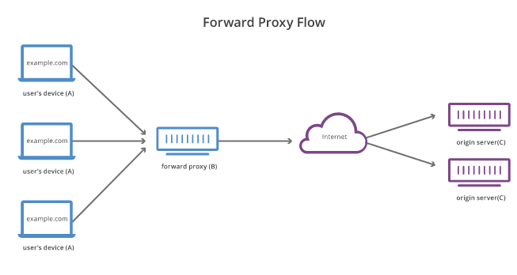

    A proxy or forward proxy is a server that sits in front of a group of users and
forwards their requests to a web server. Users communicate with the proxy server instead
of opening communication directly with the web server. It means a user sends a request to
the proxy server which forwards this request to the web server, and web server sends responses
to the proxy server which forwards this responses to the user.

    Why we are using this setup at all? Users can undirectly access to the addresses that
normally they are not permitted via proxy server, or inversely they can be forced to connect
to the web via a proxy in which some network rules, and filters are implemented. Proxy also
can be used to make tracing of users harder and to obtain better anonymity. 

    

    On the contrary of a forward proxy, reverse proxy is sitting in front of one or more web
servers and intercepting requests from clients. When clients send requests to the web server
these requests are intercepted by reverse proxy and reverse proxy sends requests to and receive
responses from web servers. 

    Why we are using reverse proxy? Some reasons are as below:
        
        - Instead of giving service from only one server, multiple servers can be set up. 
    Reverse proxy intercepts the requests and distributes the load evenly in order to prevent
    overloading of servers.

        - Due to reverse proxy, original servers don't need to reveal their IP addresses, so
    it increases protection from attacks.

        - Reverse proxies can cache the responses and can provide faster responses for upcoming
    requests.

        - SSL encryption can be done in one place thanks to reverse proxies. 

