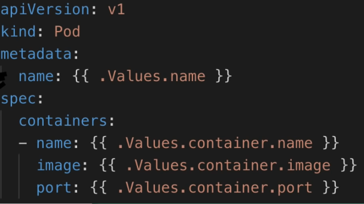
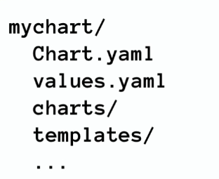

Helm is a package manager for Kubernetes.  It is useful for packaging yaml files and distributing them. For example if you want to deploy elastic stack in the kubernetes cluster in which your application resides instead of creating all kubernetes componenets manually for it you can just use helm to pull helm charts which are bundles for yaml files.

Helm also has a templating engine. Deployments and service configurations of an application can be mostly same. Instead of writing same things again and again we can use template engine of helm to define a common blueprint. Dynamic values are replaced by placeholders and values of them can be put another file called values.yaml file. In that way we only have one yaml file instead of multiple. We can define a common blueprint and by changing values.yaml file we can just use this common blueprint across different projects instead of writing lots of yaml files for all projects that includes lots of repetitive work, so it provides reusability.
                        

  

Helm charts also useful for deploying same application to different clusters. Instead of deploying yaml files to all clusters we can package them in a helm chart and just use it.

Typical directory structure of a helm chart:
				

  

Chart.yaml file contains metadata such as name, version, dependencies etc.
values.yaml file is in where we store values for template files.
charts directory stores dependencies to other charts.
templates folder is in where we store template files. When Helm evaluates a chart, it sends all of the files in the templates directory to the template rendering engine and collects results of those templates and then sends resulting file to k8s.

We can provide a different values file for templates other than default one by using --values option with helm install command: helm install --values=my_values.yaml <chart-name>. In that way default values file is overridden, but unspecified values in new values file just left as is.

Helm charts also reflect changes in deployment. It restarts the pods with new configuration.

With Helm we also use conditional statements and loops to generate charts.