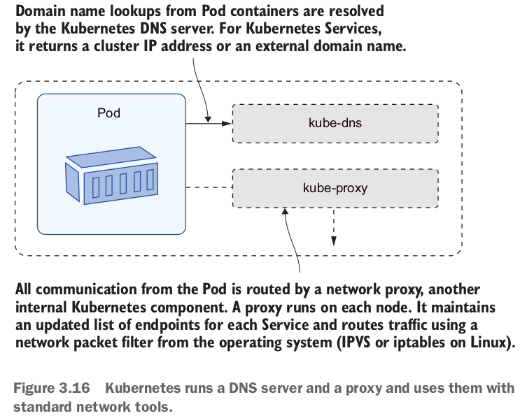

A k8s cluster has built-in DNS server which maps Service names to IP addresses.
When a service is created it is registered to DNS server with a static IP. This
IP address is reachable inside the cluster and this service is called Cluster-ip.
Instead of using network specific details of the pods we're using services which 
is an abstraction over pod and its network address. 

To access to cluster from outside of the cluster we can use LoadBalancer. LoadBalancer
service listens on an external IP address to route traffic inside cluster and also have
a cluster-ip address to make service available to components inside the cluster. Another
service type that provides access from outside to the cluster is NodePort. In this service
configuration, each node listens the port that specified in the service directly. There is
no external LoadBalancer. Because each node listens a port directly, they must be publicly
accessible. This configuration also doesn't have load balancing feature and only one port
can be exposed to each service.

Because use of LoadBalancer requires every service to have  its own external IP and load 
balancer it can be costly. In that scenario Ingresses might be more useful considering
they allow multiple services to use same IP thus reduces number of required IPs. Another
issue is when using LoadBalancer in on-prem setup, an external provider is required to
map external IPs to services. In cloud it provisioned by an external LoadBalancer.

Critical components like databases can be run outside of the k8s and k8s services can be
used for domain name resolution to components outside the cluster. ExternalName service
is an option to create such a communication. By using this service we can still create a
local name in k8s, and k8s's DNS server resolves this local name to a fully qualified
external name. On the other hand ExternalName services can cause problems with HTTP
protocol. Beacuse http requests include target host name in header field, and it doesn't
match with the actual domain from the ExternalName response. If we want to route to a IP
address instead of a name we can use headless services.

    

